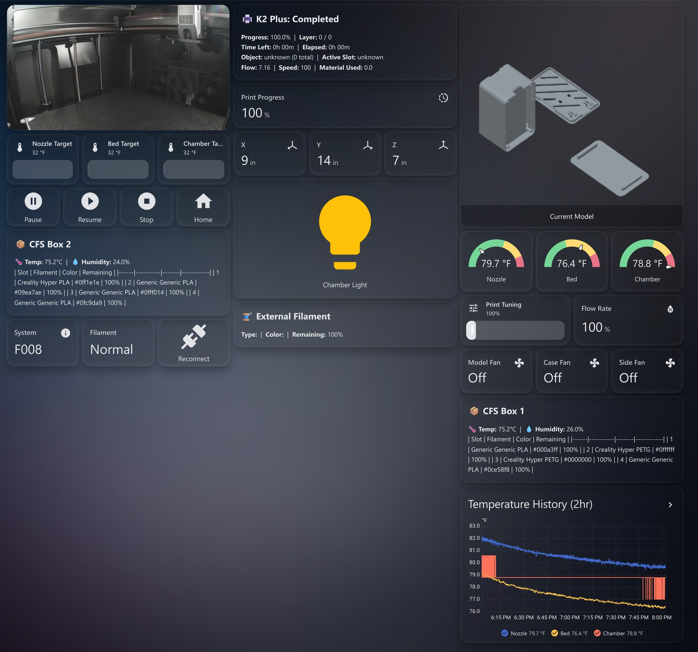

# Creality Dashboards for Home Assistant

Ready-to-use Home Assistant dashboards for Creality printers running the
[ha_creality_ws](https://github.com/3dg1luk43/ha_creality_ws) integration. Built
with stock Lovelace cards only, so no custom frontend cards are required.



## Printers

| Printer | Full dashboard | Single card |
|---|---|---|
| Creality K2 Plus | [k2-plus-dashboard.yaml](dashboards/k2-plus/k2-plus-dashboard.yaml) | [k2-plus-card.yaml](dashboards/k2-plus/k2-plus-card.yaml) |

Have another Creality model? Contributions are welcome (see [Contributing](#contributing)).

## What's on the K2 Plus dashboard

- Live camera feed
- Print status: progress, layer, time left and ETA, speed, flow, and material
- Current model preview image (auto-hides when the printer is idle)
- Temperature gauges for nozzle, bed, and chamber, with severity colors
- Adjustable temperature targets and print tuning from inline sliders
- XYZ position readout
- Print controls: pause, resume, stop (with confirmation), and home
- Chamber light toggle and fan controls (model, case, side)
- Dual CFS box filament tables (type, color, remaining percent) plus external filament status
- A 2-hour temperature history graph
- System and filament status with a reconnect button
- An attention banner when the printer errors or stops

## Setup

1. Install the [ha_creality_ws](https://github.com/3dg1luk43/ha_creality_ws)
   integration (available in HACS) and add your printer.
2. Find your printer's entity prefix. In **Developer Tools > Template**, paste:

   ```jinja
   {{ state.entity_id }}
   
   ```

   The prefix is the part before the sensor name, for example `k2plus_1516` in
   `sensor.k2plus_1516_print_status`.
3. Open the dashboard file for your printer and replace every `k2plus_XXXX` with
   your prefix (most editors do a one-click "replace all").
4. Add it to Home Assistant:
   - **Full dashboard:** create a new dashboard, open its three-dot menu >
     Raw configuration editor, and paste the file.
   - **Single card:** edit a dashboard, **Add card > Manual**, and paste the file.

## Why a separate repo

The upstream integration intentionally stays model-agnostic, so shipping a
dashboard for every printer there would add maintenance burden. Per-printer
dashboards live here instead: the integration stays lean, and each printer gets
a tailored, copy-paste layout.

## Contributing

Adding a dashboard for another Creality model is welcome. Open a PR that adds a
folder under `dashboards/<model>/` following the same approach: stock Lovelace
cards only, and the device-specific entity prefix left as the `k2plus_XXXX`-style
placeholder with find-and-replace instructions.

## License

[MIT](LICENSE).
